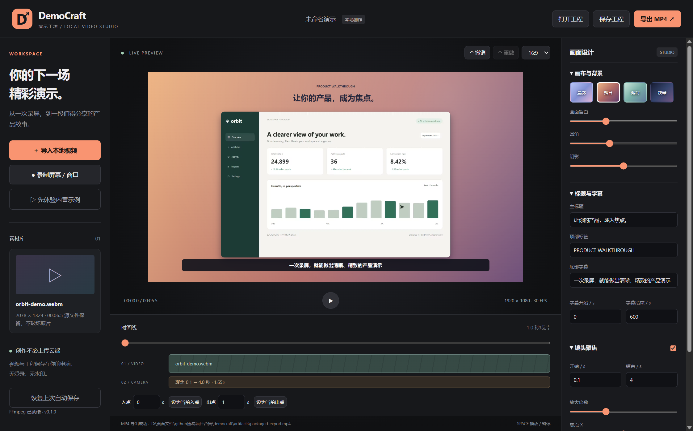

# DemoCraft · 演示工坊

**把普通录屏，变成值得分享的产品演示。**

Windows 本地优先的轻量演示视频工作台。录制窗口或导入素材，添加背景、镜头聚焦、中文标题与字幕，再导出无水印 MP4。无需登录，不调用 AI，不上传素材。

> **v0.1.0 Preview**：可以跑通真实制作流程的早期版本，不是完整专业剪辑软件。请先用短片验证你的素材和音频设备，再投入重要工作。



## 可以做什么

- **屏幕 / 窗口录制**：手动选择来源，支持可选麦克风和系统音频请求。
- **非破坏性裁剪**：设置入点 / 出点，保留原文件。
- **画面设计**：四款渐变背景、留白、圆角、阴影，16:9 / 9:16 / 1:1。
- **镜头聚焦**：一个可配置的平滑缩放区间，调整倍率和焦点。
- **中文标题和字幕**：一条带起止时间的字幕；时间均以原始素材为准。
- **隐私遮挡**：一个固定实色矩形，随视频缩放；不是自动识别或跟踪。
- **工程保存、重开、撤销 / 重做、自动保存恢复**。
- **真实 MP4 导出**：Canvas 逐帧渲染 → FFmpeg H.264 + AAC，预览与导出共用画面渲染器。
- **内置演示素材**：使用自行制作的虚构仪表盘，点击「先体验内置示例」即可上手。

适合独立开发者的产品展示、软件教程、更新说明、作品集短视频。不适合长视频剪辑和多轨后期。

## 下载与运行

下载 [Releases](https://github.com/qianjiao626/democraft/releases) 中的 Windows x64 ZIP，**完整解压**后运行 `DemoCraft.exe`，不要只提取一个 EXE。

首版未购买代码签名证书，Windows 可能显示未知发布者提示。请核对发布来源与 SHA-256，自行评估后运行。

### 导出前安装 FFmpeg

本软件**不附带 FFmpeg**。请安装包含 `libx264` 和 AAC 编码器的 FFmpeg，并确保命令行可运行：

```powershell
ffmpeg -version
ffmpeg -encoders
```

Windows 可通过你信任的软件源安装，例如：

```powershell
winget install --id Gyan.FFmpeg -e
```

安装后重新打开应用；必要时重新登录 Windows，使 PATH 更新。也可显式指定：

```powershell
$env:DEMOCRAFT_FFMPEG = 'C:\tools\ffmpeg\bin\ffmpeg.exe'
.\DemoCraft.exe
```

启动后左下角会显示编码器检测结果。检测存在不代表所有素材都可解码。

## 三分钟上手

1. 点击「先体验内置示例」，或导入 MP4 / WebM / MOV / MKV。
2. 在右侧选背景、改标题；在时间线设置入点和出点。
3. 开启镜头聚焦，设置原始素材中的时间与焦点。按空格预览。
4. 需要时开启隐私遮挡并调位置，**全程检查敏感信息是否被覆盖**。
5. 点击保存工程，或导出 MP4。导出是离线逐帧处理，可能慢于视频时长。

快捷键：`Space` 播放 / 暂停、`Ctrl+S` 保存、`Ctrl+Z` 撤销、`Ctrl+Shift+Z` 重做。输入框获得焦点时不拦截这些按键。

## 边界与已知限制

- 首版一次只能编辑**一个视频、一个聚焦区间、一条字幕、一个遮挡矩形**；没有多轨、转场、自动字幕、AI 镜头或自动鼠标跟踪。
- 成片最长 **5 分钟**；横屏 1920×1080、竖屏 1080×1920、方形 1080×1080，固定 30 FPS。
- 录屏最长 5 分钟；片段暂存在内存，约 350MB 时主动停止，高分辨率录制仍可能占用较多内存。
- 输入容器名不是兼容保证：实际取决于 Chromium 支持的编码。建议 H.264 MP4、VP8/VP9 WebM；不支持的 HEVC 等请自行转码。
- 系统音频和麦克风依赖 Windows 权限、设备与驱动。**当前真实验证覆盖无音频窗口录制与导入视频的音频导出；没有宣称所有声卡均验证通过。**
- 工程只引用源文件，不打包素材。移动素材后打开工程会要求重新定位；自动恢复目前不提供重新定位。
- 编辑参数变动后约 0.8 秒自动保存。只保留一份恢复记录；关闭前请主动保存重要工程。文件系统不支持原子替换时使用复制后替换，不承诺断电一致性。
- 遮挡不会自动追踪；不能保证自动移除隐私。录制与发布前确认个人信息、授权及版权，遵守适用法律。
- 无自动更新、无云同步、未做 macOS / Linux 适配和签名。

## 从源码运行

需要 Node.js 22+、Windows x64、FFmpeg。

```powershell
npm ci
# 若 npm 禁用了安装脚本且 Electron 二进制缺失：
node node_modules/electron/install.js
npm start
npm test
npm run check
npm run pack:zip
```

开发依赖需要联网下载。打包使用 Electron Builder，不把外部 FFmpeg 混入 MIT 包。

## 实现与验证

```text
src/main.cjs      Electron 主进程、受限素材协议、工程 IO、FFmpeg 导出
src/preload.cjs   白名单 IPC 桥接
src/core.js       参数校验、时间计算、镜头曲线（可独立测试）
src/render.js     预览和导出的统一 Canvas 渲染器
src/editor.js     编辑、历史记录、录制、确定性逐帧导出
```

渲染进程禁用 Node.js，启用 sandbox / contextIsolation / CSP。导出子进程使用参数数组，不拼接 shell 命令；素材路径必须先通过文件选择或录制授权。

`npm test` 执行核心单元测试。桌面集成测试须在有桌面的 Windows 会话中运行，并依赖 FFmpeg；只录制测试脚本自己创建的虚构窗口：

```powershell
New-Item -ItemType Directory -Force artifacts
ffmpeg -y -f lavfi -i "testsrc2=size=1280x720:rate=30" -f lavfi -i "sine=frequency=440:sample_rate=48000" -t 3 -c:v libx264 -pix_fmt yuv420p -c:a aac artifacts/test-source.mp4
npm run test:smoke
npm run test:integration
```

参见 [验证记录](VERIFICATION.md)。自动化不能替代硬件兼容性测试。

## License

应用自有代码使用 MIT。Electron / Chromium / Node.js 等依赖保留各自许可；详见 [THIRD_PARTY_NOTICES.md](THIRD_PARTY_NOTICES.md)。FFmpeg 为用户独立安装组件，其构建可能受 LGPL / GPL 条款约束，不能按本项目 MIT 许可重新分发。
